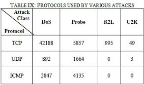

##Dataset NSL-KDD
NSL-KDD adalah dataset yang berisi data koneksi normal maupun data koneksi serangan hacker dalam sebuah jaringan. Dataset ini merupakan penyempurnaan dari KDD'99. Dataset ini disediakan oleh University of New Brunswick.

###Kelebihan
Kelebihan NSL-KDD dibanding KDD'99 adalah:
<ol>
<li>Tidak memiliki data redundan</li>
<li>Hanya menggunakan atribut yang relevan</li>
<li>Sebaran jenis koneksi normal dan serangan proporsional</li>
<li>Jumlah data yang lebih rasional</li>
</li>

Berikut adalah detil dari dataset NSL-KDD

