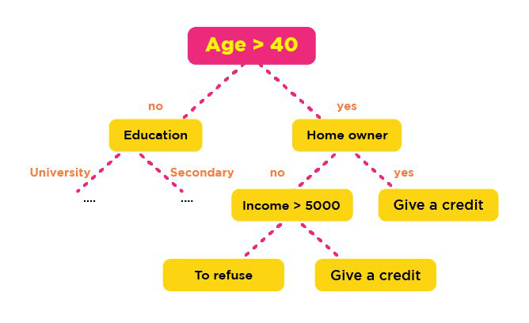

##Pengertian

Decision tree adalah salah satu metode klasifikasi yang paling populer, karena mudah untuk diinterpretasi oleh manusia. Decision tree adalah model prediksi menggunakan struktur pohon atau struktur berhirarki.

Konsep dari pohon keputusan adalah mengubah data menjadi decision tree dan aturan-aturan keputusan. Manfaat utama dari penggunaan decision tree adalah kemampuannya untuk mem-break down proses pengambilan keputusan yang kompleks menjadi lebih simple, sehingga pengambil keputusan akan lebih menginterpretasikan solusi dari permasalahan.

Decision tree juga berguna untuk mengeksplorasi data, menemukan hubungan tersembunyi antara sejumlah calon variabel input dengan sebuah variabel target. Decision tree memadukan antara eksplorasi data dan pemodelan, sehingga sangat bagus sebagai langkah awal dalam proses pemodelan bahkan ketika dijadikan sebagai model akhir dari beberapa teknik lain.

Dalam beberapa aplikasi, akurasi dari sebuah klasifikasi atau prediksi adalah satu-satunya hal yang ditonjolkan dalam metode ini, misalnya sebuah perusahaan direct mail membuat sebuah model yang akurat untuk memprediksi anggota mana yang berpotensi untuk merespon permintaan, tanpa memperhatikan bagaimana atau mengapa model tersebut bekerja.

##Algoritma

Langkah-langkah dalam algotima KNN adalah
Secara umum algoritma membangun Decision Tree adalah
	
<ul>
<li>Pilih fitur sebagai root</li>
<li>Buat cabang untuk masing-masing nilai</li>
<li>Bagi kasus dalam cabang</li>
</ul>