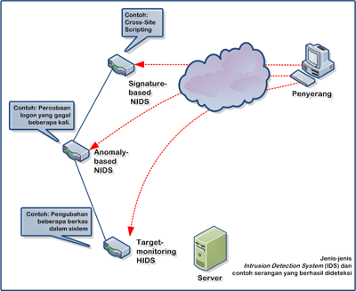

##Pengertian
Intrusion Detection System (disingkat IDS) adalah sebuah metode yang dapat digunakan untuk mendeteksi aktivitas yang mencurigakan dalam sebuah sistem atau jaringan. IDS dapat melakukan inspeksi terhadap lalu lintas inbound dan outbound dalam sebuah sistem atau jaringan, melakukan analisis dan mencari bukti dari percobaan intrusi (penyusupan).

##Cara Kerja
Ada beberapa cara bagaimana IDS bekerja. Cara yang paling populer adalah dengan menggunakan pendeteksian berbasis signature (seperti halnya yang dilakukan oleh beberapa antivirus), yang melibatkan pencocokan lalu lintas jaringan dengan basis data yang berisi cara-cara serangan dan penyusupan yang sering dilakukan oleh penyerang. Sama seperti halnya antivirus, jenis ini membutuhkan pembaruan terhadap basis data signature IDS yang bersangkutan.
Metode selanjutnya adalah dengan mendeteksi adanya anomali, yang disebut sebagai Anomaly-based IDS. Jenis ini melibatkan pola lalu lintas yang mungkin merupakan sebuah serangan yang sedang dilakukan oleh penyerang. Umumnya, dilakukan dengan menggunakan teknik statistik untuk membandingkan lalu lintas yang sedang dipantau dengan lalu lintas normal yang biasa terjadi. Metode ini menawarkan kelebihan dibandingkan signature-based IDS, yakni ia dapat mendeteksi bentuk serangan yang baru dan belum terdapat di dalam basis data signature IDS. Kelemahannya, adalah jenis ini sering mengeluarkan pesan false positive. Sehingga tugas administrator menjadi lebih rumit, dengan harus memilah-milah mana yang merupakan serangan yang sebenarnya dari banyaknya laporan false positive yang muncul.

Teknik lainnya yang digunakan adalah dengan memantau berkas-berkas sistem operasi, yakni dengan cara melihat apakah ada percobaan untuk mengubah beberapa berkas sistem operasi, utamanya berkas log. Teknik ini seringnya diimplementasikan di dalam HIDS, selain tentunya melakukan pemindaian terhadap log sistem untuk memantau apakah terjadi kejadian yang tidak biasa.
