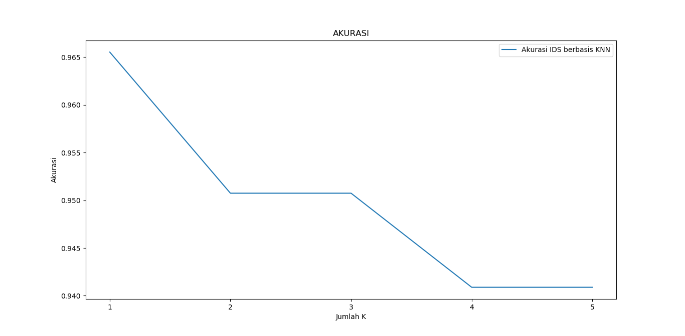

##Implementasi
###Package Requirement
Penelitian ini menggunakan Scikit-learn untuk mengolah dan menganalisis data. Didalam scikit juga telah terdapat berbagai algoritma analisis data yang dapat digunakan tanpa harus menulis source code dari awal. Untuk menggunakan Scikit-learn kita harus menginstall software berikut.

<li>Python (>= 3.5)</li>
<li>NumPy (>= 1.11.0)</li>
<li>SciPy (>= 0.17.0)</li>
<li>joblib (>= 0.11)</li>
<li>Matplotlib (>= 1.5.1)</li>
<li>Pandas (>= 0.18.0)</li>

###Package Installation
Untuk menginstall package tersebut kita bisa menggunakan perintah pip. Sebagai catatan, instalasi package tersebut membutuhkan koneksi internet

``` sh
pip install numpy,scipy,joblib,matplotlib,pandas
```
###Coding
 Setelah proses instalasi selesai kita bisa mengimport library-library tersebut dari python kita.

```python
import numpy as np
import matplotlib.pyplot as plt
from sklearn.model_selection import train_test_split
from sklearn.neighbors import KNeighborsClassifier
import pandas as pd

```
Selanjutnya kita dapat memasukkan data set berupa file csv

```python
lokasi_file=input("Masukkan lokasi file data training : ")
data_train= pd.read_csv(lokasi_file)
```
Data dalam dataset terbagi atas atribut fitur dan atribut target. Dalam dataset NSL-KDD atribut target adalah atribut'status' sedangkan fitur adalah atribut selain 'status'. Nantinya atribut fitur akan digunakan untuk memprediksi nilai dari atribut target. Untuk itu dalam source code kita harus disertakan kode untuk membagi data dalam dataset kedalam atribut fitur dan atribut target, serta kode untuk mengambil nama kolom atribut. 

```python
#Mengambil dataset dari atribut selain status sebagai data atribut fitur
#dan dari data status sebagai atribut target
x,y = data_train.loc[:,data_train.columns != 'status'], data_train.loc[:,'status']
#Mengambil data kolom atiribut fitur
col=data_train.columns.tolist()
col.remove('status')

```
Selanjutnya kita akan membangun KNN Classifier dengan N 1- masukan pengguna. Pada bagian ini juga dilakukan pre-processing data berupa encoding dengan metode one hot encoding seperti dijelaskan pada bagian metode penelitian. Variable x akan berisi data dari atribut fitur sedangkan y akan berisi data dari atribut target.
```python
#Membangun KNN Classifier dengan n mulai dari 1 hingga - n sesuai masukan pengguna
n=input("Masukkan nilai N maksimal yang anda inginkan")
knn = KNeighborsClassifier(n_neighbors = n)
#Melakukan enccoding pada atribut yang berisi string.
x=pd.get_dummies(x, columns=col)
y=pd.get_dummies(y, columns=['status'])

```
Setelah pre-processing, tahap berikutnya adalah pengujian. Pada tahap ini 80% dataset akan digunakan sebagai data training dan 20% sebagai data uji. Nantinya akan dihitung berapa persen akurasinya untuk masing masing nilai K.
```python

# membangun traning set, dimana 80% utk training dan 20% utk testing
x_train,x_test,y_train,y_test = train_test_split(x,y,test_size = 0.2)
neig = np.arange(1,n)
train_accuracy = []
test_accuracy = []
for i, k in enumerate (neig):
    knn = KNeighborsClassifier(n_neighbors = k)
    knn.fit(x_train,y_train)
    train_accuracy.append(knn.score(x_train,y_train))
    test_accuracy.append(knn.score(x_test,y_test))
```
###Visualiasi Hasil 
Dan pada akhirnya hasil pengujian tersebut ditampilkan dalam bentuk grafik agar mudah dimengerti
```python
# Plot
plt.figure(figsize=(13,8))
plt.plot(neig, test_accuracy, label = 'Akurasi IDS berbasis KNN')
plt.legend()
plt.title('AKURASI')
plt.xlabel('Jumlah K')
plt.ylabel('Akurasi')
```

<center>[](assets/images/hasil.png)</center>


