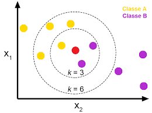

##Sekilas Tentang Algortima K-Nearset Neighbor

Algoritma k-nearest neighbor (KNN) adalah sebuah metode untuk melakukan klasifikasi terhadap objek yang berdasarkan dari data pembelajaran yang jaraknya paling dekat dengan objek tersebut. KNN meupakan algoritma supervised learning dimana hasil dari query instance yang baru diklasifikan berdasarkan mayoritas dari kategori pada algoritma KNN. Dimana kelas yang paling banyak muncul yang nantinya akan menjadi kelas hasil dari klasifikasi.
Tujuan algoritma ini adalah mengklasifikasikan obyek baru berdasarkan atribut dan training sample. Didalam classifier tidak menggunakan model apapun untuk dicocokkan dan hanya berdasarkan pada suatu memori. Titik query, akan ditemukan sejumlah K obyek atau (titik training) yang paling dekat dengan titik query. Algoritma k-nearest neighbor  (KNN) menggunakan klasifikasi ketetanggaan sebagai nilai prediksi dari query instance yang baru.

Algoritma metode k-nearest neighbor (KNN) sangatlah sederhana, bekerja berdasarkan jarak terpendek dari query instance ke training sample untuk menentukan KNN-nya. Training sample diproyeksikan ke ruang berdimensi banyak, dimana masing-masing dimensi merepresentasikan fitur dari data. Ruang ini dibagi menjadi bagian-bagian berdasarkan klasifikasi training sample. Sebuah titik pada ruang ini ditandai oleh kelas  jika kelas C merupakan klasifikasi yang paling banyak ditemui pada K (tetangga terdekat dari titik tersebut). Dekat atau jauhnya tetangga biasanya dihitung berdasarkan <i>Euclidean Distance</i>. Jarak Euclidean paling sering digunakan menghitung suatu jarak. Dimana jarak euclidean memiliki fungsi untuk menguji ukuran yang bisa digunakan sebagai interpretasikedekatan jarak antara dua obyek.

##Algoritma

Langkah-langkah dalam algotima KNN adalah

<ul>
<li>Tentukan parameter K ( jumlah tetangga terdekat)</li>
<li>Hitung Kuadrat Eulid masing-masing objek terhadap data sample</li>
<li>Urutkan objek kedalam kelompopk yang memilki jarak terdekat</li>
</ul>