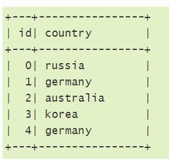
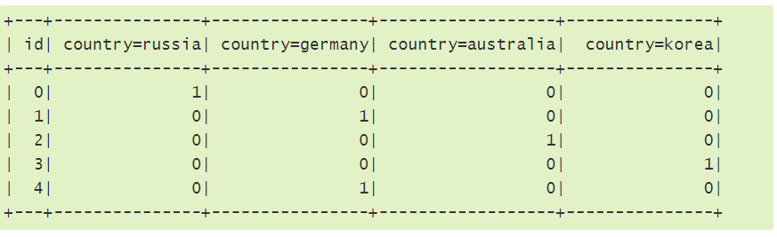

Tahapan-tahapan yang dilalui dalam penelitian ini adalah

####Data Pre-processing
Data-preprocessing bertujuan untuk memperbaiki kualitas data dengan mengubah format data sehingga siap digunakan oleh KNN Classifier. Pada NSL_KDD terdapat beberapa atribut yang berisi string, sedangkan KNN hanya memproses data berupa angka. Untuk itu atribut yang berupa string diubah menjadi angka menggunakan metode One Hot Encoder yang disediakan oleh pandas. Misal mula-mula terdapat data negara seperti dibawah ini.

Setelah dilakukan perubahan dengan metode One Hot Encoder hasilnya adalah

###Data Training
Data training dilakukan agar program dapat mengambil kesimpulan berdasarkan data yang telah ada.Data training harus dilakukan secara proporsional, jumlah data training yang terlalu sedikit menyebabkan akurasi berkurang, sebaliknya data traning yang terlalu banyak juga menyebabkan akurasi menurun akibat over-fitting dan waktu uji juga lebih lama. Dalam penelitian ini menggunakan split training dimana 80% data digunakan untuk training dan 20% untuk pengujian

###Pengujian
Pengujian dilakukan untuk menilai akurasi algoritma Knn dalam mendeteksi serangan. Pengujian dilakukan dengan mengubah nilai K dan kemudian memperhatikan pengaruhnya terhadap nilai akurasi.

